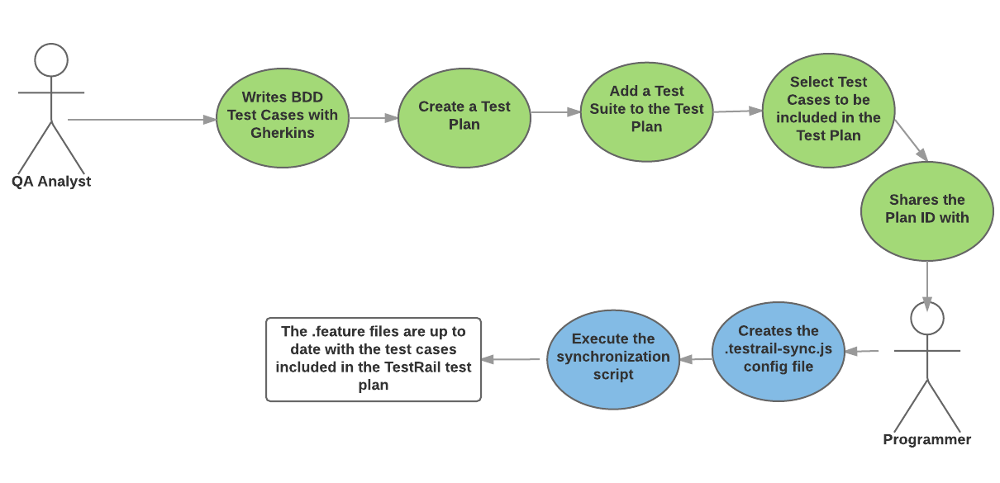

# cucumber-testrail-sync

This module has two main features:

> It can synchronize test cases from TestRail to `.feature` files on your local filesystem.

We propose the following collaborative workflow for BDD testing:



------------

> It can automatically push test results back to TestRail.

## Installation

> npm i cucumber-testrail-sync [-g]

## Usage (test cases synchronization)

At the root of your project, create the `.testrail-sync.js` file.

```js
module.exports = {
  testrail: {
    host: '', // testrail host
    user: '', // testrail username
    password: '', // testrail password or api key
    filters: {
      plan_id: '', // testrail plan id
    }
  },
};
```

There are other possible options:

  * __overwrite__: Toggle the local .feature file overwrite OR remote test case overwrite if the local Gherkins doesn't match the TestRail Gherkins.

  ```js
  overwrite: {
    local: 'ask',
    remote: false,
  }
  ```

  * __testFilesTemplate__:  The template to use to generate blank step definition files (ie. `testFilesTemplate: 'cucumberjs.es5'`)

  * __indent__: The indentation to use when generating `.feature` or `.js` files (ie. `indent: '    '`)

  * __featuresDir__:  The directory where `.feature` files should be created (ie. `featuresDir: 'features'`)

  * __jsDir__:  The directory where blank step definition files should be created  (ie. `featuresDir: 'features/step_definitions'`)

Then you can run the `testrail-sync` command (or `./node_modules/.bin/testrail-sync` if it's not installed globally).

## Usage (test results synchronization)

You will first need to setup the `.testrail-sync.js` config file, as described above.

The typical flow is:

1. Create a test plan in Test Rail
2. Start Cucumber Tests
3. Create New Test Run before executing feature files
4. Parse the `@tcid` metatag from the feature file
5. Update result for each scenario

It is recommended to use a `BeforeFeatures` hook to create the new test run like this:
```
this.registerHandler('BeforeFeatures', function (features, callback) {
  testrailsync.createNewTestRun(callback);
});
```
This will take care of creating a new test run attached to the TestPlanID provided in the `.testrail-sync.js` file.

Next, you need a hook that will update the scenario results. You can use the `After` event to do so:
```
this.After(function (scenario, callback) {
  testrailsync.updateResult(scenario, callback);
});
```
### @tcid metatag
The matching TestRail ID for each each scenario must be provided using a Cucumber metatag called `@tcid`. Here is an example:
```
Feature: Send result to testrail
@tcid:2151
Scenario: send a pass result
Given the number "3"
When I add the number "4"
Then total is "7"
```
